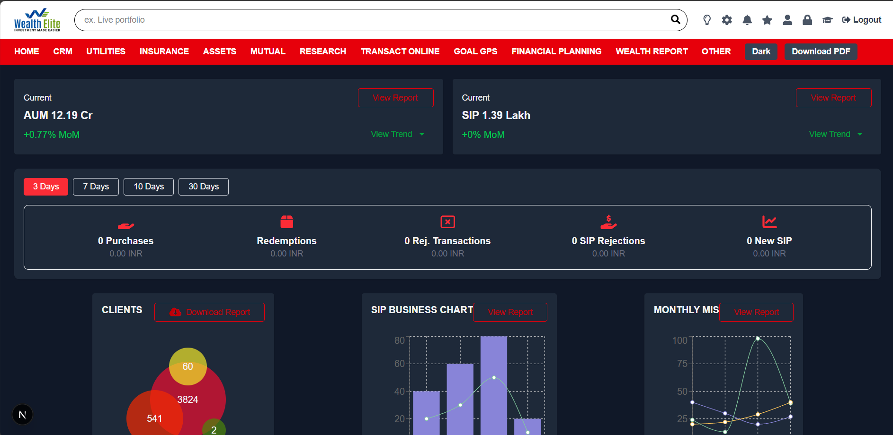

# Wealth Elite Dashboard

A responsive Next.js dashboard application for monitoring wealth management metrics such as AUM, SIP, purchases, redemptions, and client statistics. The dashboard includes charts (Line, Bar, and Pie) using Recharts and a PDF download functionality using `html2canvas` and `jsPDF`.




---

## Features

- Dark/Light mode toggle.
- AUM and SIP cards with MoM trends.
- Filters for data range (3, 7, 10, 30 days).
- Overview cards for Purchases, Redemptions, Rejected Transactions, SIP Rejections, and New SIPs.
- Client visualization with pie chart representation.
- SIP Business chart (Bar + Line chart).
- Monthly MIS chart (Line chart).
- Export dashboard as PDF.

---

## Tech Stack

- **Next.js** (React framework)
- **Tailwind CSS** (for styling)
- **Recharts** (for charts)
- **html2canvas & jsPDF** (for PDF export)

---

## Installation & Setup

### 1. Clone the repository

```bash
git clone <your-repo-url>
cd <your-repo-folder>

npm install
# or
yarn install

Open http://localhost:3000 with your browser to see the dashboard.

.
├── app
│   └── pages.js          # Dashboard component
├── public
│   └── screenshot.png  # Dashboard screenshot
├── styles
│   └── global.css       # Tailwind CSS imports
├── package.json
└── tailwind.config.js

## Getting Started

First, run the development server:

```bash
npm run dev
# or
yarn dev
# or
pnpm dev
# or
bun dev
```

Open [http://localhost:3000](http://localhost:3000) with your browser to see the result.

"# Financial-Dashboard" 
